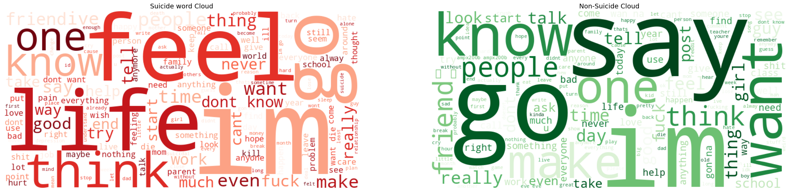
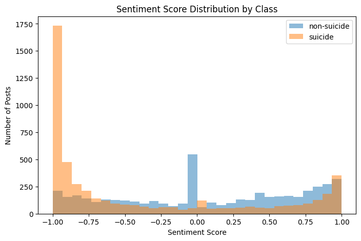
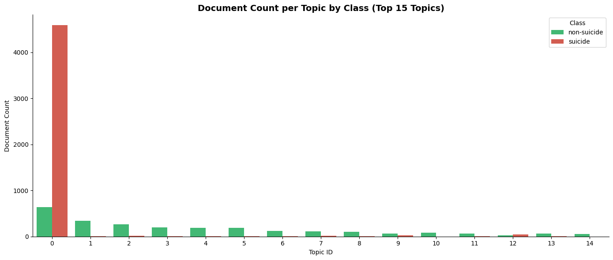
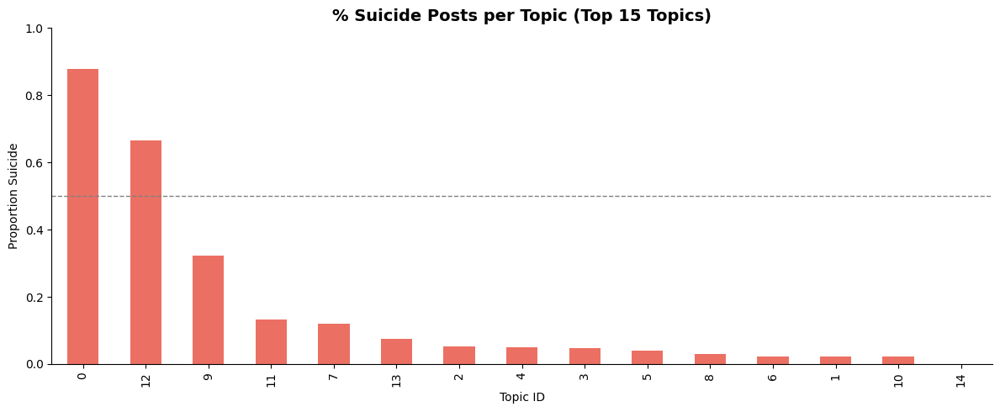
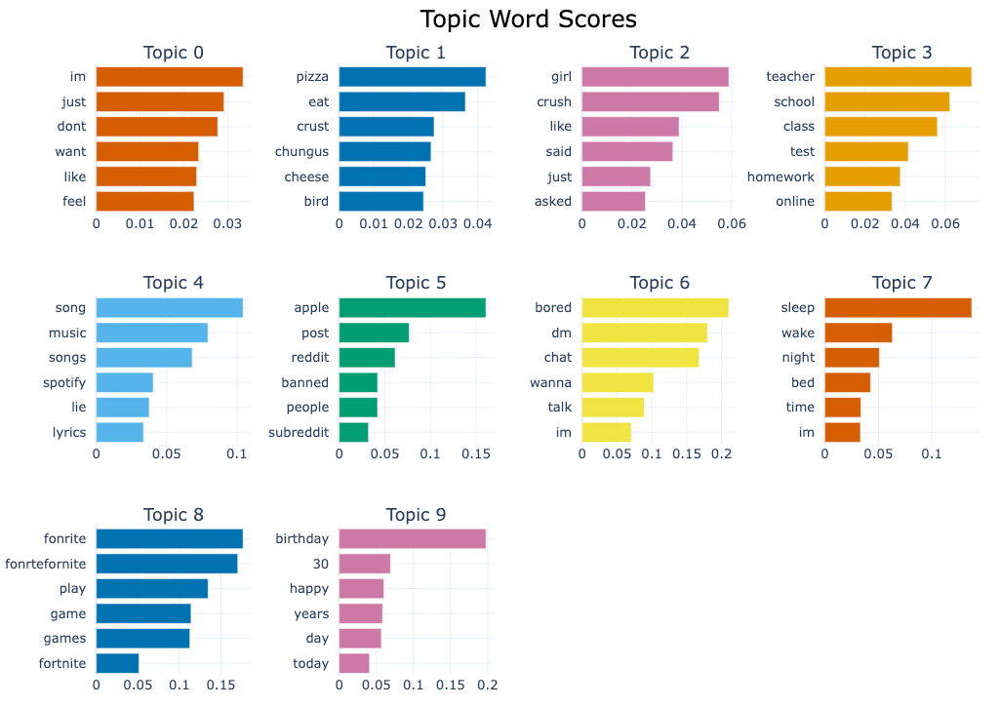
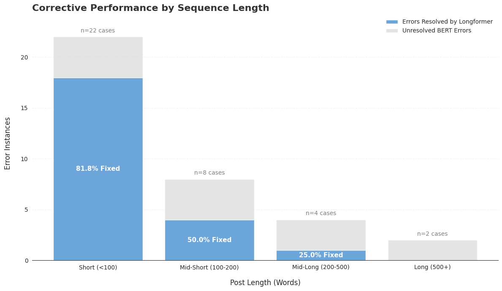

# Mental Health Crisis Signal Detection — NLP Text Classification

An end-to-end NLP pipeline comparing 8 models (classical ML and transformer-based deep learning) for detecting mental health crisis signals in Reddit posts.

---

## Background
Suicide is a leading public health concern: in 2024 alone, 48,824 suicide-related deaths were recorded in the U.S., with an estimated 14.3 million adults reporting suicidal thoughts. Psychological distress is increasingly expressed on social media platforms like Reddit, making automated early detection a meaningful research and applied problem. This project explores whether NLP models can reliably distinguish crisis-related posts from general discourse.

---

## Overview

This project builds a binary text classification system to identify suicidal ideation in social media text. Using the [Kaggle Suicide Watch dataset](https://www.kaggle.com/datasets/nikhileswarkomati/suicide-watch) (232,074 Reddit posts), we systematically compare six classical TF-IDF models against two fine-tuned transformer architectures(BERT and Longformer)and conduct unsupervised topic discovery via BERTopic.

---
## EDA Highlights

Word Frequency by Class  

Suicidal posts showed more emotionally intense and self-focused language; non-suicidal posts contained broader conversational vocabulary.


Sentiment Score Distribution (VADER)  

Suicidal posts had a significantly lower average compound sentiment score (−0.388) compared to non-suicidal posts (0.101), confirming emotional tone as a useful classification signal.


BERTopic: Unsupervised Topic Discovery  

BERTopic (UMAP + HDBSCAN + sentence embeddings) was applied to the full 232K corpus without labels. The majority of suicide-labeled documents clustered into Topic 0, validating that the textual content is semantically distinct across classes.




## Results
**Performance Heatmap: All 8 Models**


| Model | Accuracy | F1 | Precision | Recall | AUC |
|---|---|---|---|---|---|
| **Longformer-base-4096** | **0.977** | **0.978** | **0.967** | **0.990** | **0.997** |
| BERT-base-cased (Head+Tail) | 0.965 | 0.966 | 0.961 | 0.972 | 0.993 |
| SVC (Unigrams) | 0.909 | 0.910 | 0.926 | 0.895 | 0.964 |
| Logistic Regression (Unigrams) | 0.902 | 0.903 | 0.918 | 0.888 | 0.962 |
| Naive Bayes (Unigrams) | 0.878 | 0.890 | 0.831 | 0.957 | 0.961 |

**Accuracy & F1 Score: Classical vs Deep Learning**


**ROC Curves: All 8 Models**


**Key finding:** Longformer outperformed BERT by 0.018 in recall, demonstrating that preserving full post context,rather than truncating the middle, provides meaningful signal for high-risk content detection, even on short posts under 100 words.


---

## Project Structure

```
nlp-crisis-text-classification/
├── README.md
├── requirements.txt
├── .gitignore
├── EDA.ipynb                              # EDA, preprocessing & topic modeling
├── classical_models.ipynb                 # SVC, Naive Bayes, Logistic Regression
└── deep_learning_Model_Comparison.ipynb   # BERT & Longformer fine-tuning
```

> `df_clean.csv` is generated by running `EDA.ipynb` and is excluded from version control via `.gitignore`.

---

## Tech Stack

- **NLP / ML:** scikit-learn, HuggingFace Transformers, BERTopic, NLTK, VADER
- **Models:** BERT-base-cased, Longformer-base-4096, SVC, Naive Bayes, Logistic Regression
- **Features:** TF-IDF (unigrams / bigrams), transformer tokenization
- **Topic Modeling:** BERTopic (UMAP + HDBSCAN + sentence embeddings)
- **Cloud / Compute:** Google Colab (GPU), Python 3.12

---

## Setup

### 1. Clone the repo
```bash
git clone https://github.com/YOUR_USERNAME/nlp-crisis-text-classification.git
cd nlp-crisis-text-classification
```

### 2. Install dependencies
```bash
pip install -r requirements.txt
```

### 3. Configure Kaggle credentials
Download `kaggle.json` from your [Kaggle account settings](https://www.kaggle.com/settings) → API → Create New Token, then:

```bash
mkdir ~/.kaggle
mv ~/Downloads/kaggle.json ~/.kaggle/
chmod 600 ~/.kaggle/kaggle.json
```

### 4. Run notebooks in order
```
EDA.ipynb → classical_models.ipynb → deep_learning_Model_Comparison.ipynb
```

> **Note:** Deep learning notebook requires GPU. We recommend running it on [Google Colab](https://colab.research.google.com/) with GPU runtime enabled.

---

## Methodology

### Data Preprocessing
Two cleaning pipelines were applied depending on model type:
- **Classical models:** deep clean — filler removal, lowercasing, punctuation stripping, stopword removal, POS-aware lemmatization
- **Deep learning models:** light clean — filler removal and whitespace normalization only, preserving sentence structure for the tokenizer

Non-English posts were filtered using `langdetect` prior to modeling.

### Model Design
- **Classical:** TF-IDF (5,000 features) with unigram and unigram+bigram variants
- **BERT:** Head+Tail truncation — first 128 and last 382 tokens retained to fit 512-token limit
- **Longformer:** Sliding window attention — full post up to 4,096 tokens, no truncation

### Evaluation
All models evaluated on Accuracy, F1, Precision, Recall, and AUC-ROC. Recall was prioritized as the primary metric given the high cost of false negatives in mental health contexts.

---

## Key Findings

- Longformer achieved the best overall performance (F1: 0.978, AUC: 0.997)
- Transformer models substantially outperformed classical baselines across all metrics
- Adding bigrams produced marginal improvement for classical models
- Naive Bayes showed notably high recall (0.938–0.957) at the cost of precision
- Suicidal posts showed significantly lower VADER sentiment scores (avg: -0.388 vs 0.101 for non-suicidal)
- BERTopic revealed semantically distinct topic clusters between classes without label supervision

---

## Limitations & Future Work

- **Data coverage:** Trained on English Reddit only; performance on other languages and platforms remains unknown. Future work could explore multilingual models such as mBERT or XLM-R
- **Task granularity:** Binary labels cannot reflect real-world risk severity; a natural next step is multi-class risk grading aligned with clinical instruments (e.g. Columbia Suicide Severity Rating Scale)
- **Explainability:** No interpretability layer currently; applying SHAP or LIME would enable token-level explanations suitable for clinical or platform deployment

---

## Dataset

- **Source:** [Suicide Watch — Kaggle](https://www.kaggle.com/datasets/nikhileswarkomati/suicide-watch)
- **Size:** 232,074 Reddit posts (balanced binary classes)
- **Sample used:** 10,000 posts (random seed 42)
- **Language:** English only (filtered via langdetect)
